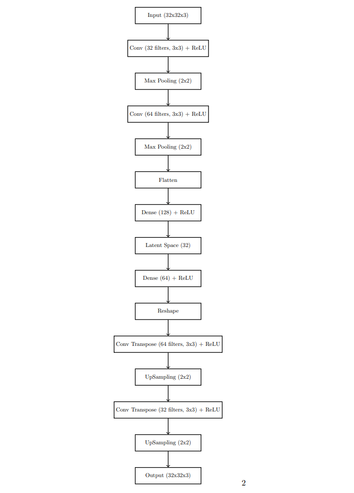

# JTP-Technical-project - Image Recommendation System

## Overview

This project focuses on developing an Image Recommendation System aimed at enhancing the shopping experience by suggesting products that are visually similar to the one being viewed by the user. By doing so, it offers a tailored and engaging browsing experience.

### Core Engine

At the heart of the recommendation engine is an autoencoder model. This model is adept at learning image features through an unsupervised learning approach. Specifically, the encoder part of the autoencoder is utilized to generate feature vectors for images. These vectors are subsequently stored in a Qdrant vector database, which underpins efficient similarity searches and retrieval of products that visually align with the user's interests.

### Dataset

The system is trained using a dataset sourced from Kaggle, encompassing 44,000 fashion products. This dataset includes multiple category labels, product descriptions, and high-resolution images, making it a comprehensive foundation for training our model. The dataset is accessible here: [Fashion Product Images Dataset](https://www.kaggle.com/datasets/paramaggarwal/fashion-product-images-dataset?rvi=1)

### Technology Stack

- **Backend:** The backend infrastructure is constructed using **FastAPI**, a contemporary and fast web framework designed for building APIs with Python.
- **Frontend:** For the frontend, **React JS** is employed, with **Redux** serving as the state management solution, ensuring a dynamic and seamless user interface.
- **Vector Database:** The image feature vectors are stored and queried using **Qdrant**, a vector database that enables efficient similarity searches.

## Setup Instructions
  > **Prerequisites:** Docker installed on your machine, and a basic understanding of Docker and terminal commands.

1. **Repository Cloning:**
   Execute the following command to clone the repository:
   ```python
   git clone -b main https://github.com/arunchandra23/JTP-Technical-project.git
   ```
2. **Application Startup**\
      Navigate to the project directory:
      ```bash
      cd JTP-Technical-project/
      ```
      Utilize the application by loading the saved model and embeddings with Docker:
      ```bash
      docker-compose up --build
      ```
  - **Frontend:** The application can be accessed at [http://localhost:3000](http://localhost:3000), view a product to get recommendations.
  - **Backend:** The FastAPI backend, serving the React frontend, is available at [http://localhost:8000](http://localhost:8000).
  - **Database:** Access the Qdrant vector database dashboard at [http://localhost:6333/dashboard](http://localhost:6333/dashboard).
        

## Training Pipeline
### You can also train the model from scratch instead of using pre-trained weights by following below instructions. 

  The training process is facilitated through notebooks located in `JTP-Technical-project/preprocessing/`.

  > **Note:**
  > For training, running the Qdrant is necessary for saving the feature vectors/embeddings. [Click here to view instruction to set-up Qdrant](assets/QDRANT.md).
  ### Please follow below steps to train model and store image embeddings:

  - **Step-1 : Dataset Preparation**\
      Utilize the [`dataset_pre_processing.ipynb`](preprocessing/dataset_pre_processing.ipynb) notebook for downloading the image dataset and creating test & train splits.
  - **Step-2 : Training**\
      The [`train.ipynb`](preprocessing/train.ipynb) notebook is used for training the Autoencoder model. The trained model is saved to [`backend/model/encoder_model.keras`](backend/model/encoder_model.keras).
  - **Step-3 : Embedding** \
      The [`embed.ipynb`](preprocessing/embed.ipynb) notebook allows for loading the saved model to extract feature vectors from images, which are then stored in the Qdrant vector database.

      Follow instructions [here](assets/QDRANT.md) to take a snapshot of saved embeddings and save it to [backend/data/](backend/data/) as `fashion_products_vdb.snapshot`

## Architecture

<p align="center">
  
</p>