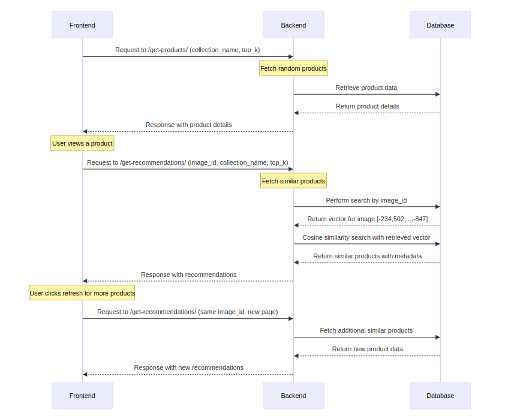

# Workflow: Image Recommendation System

## Overview

This document outlines the workflow of the Image Recommendation System which integrates both frontend and backend components to deliver visually similar product recommendations to users. The system utilizes two main API endpoints, `/get-products/` and `/get-recommendations/`, to fetch initial product displays and subsequent recommendations based on user interaction.

## API Endpoints and Workflow

### 1. Fetching Initial Products

#### Endpoint: `/get-products/`
- **Function:** `get_products`
- **Description:** This endpoint retrieves a specified number of random products from a given collection. It is used to populate the frontend with initial products for the user to view.

#### Workflow:
- The frontend makes a request to the `/get-products/` API, specifying the collection name and the number of products (`top_k`) to retrieve.
- **Response Structure:**
  ```json
  [
      {
          "id": "unique-product-id",
          "url": "link-to-product-image",
          "productDisplayName": "Product Name",
          "gender": "Gender Category",
          "baseColour": "Color",
          "masterCategory": "Main Category",
          "subCategory": "Sub Category",
          "articleType": "Type of Article",
          "season": "Applicable Season",
          "usage": "Usage Type"
      }
  ]
  ```
- The response includes essential product details such as ID, image URL, and descriptive attributes, which are displayed on the frontend.

### 2. Getting Recommendations Based on User Interaction

#### Endpoint: `/get-recommendations/`
- **Function:** `get_recommendations`
- **Description:** Retrieves recommendations for a given image based on visual similarity. This is triggered when a user views a product, and the system performs a similarity search to find and suggest similar products.

#### Workflow:
- When a user clicks on a product, the frontend captures the image ID of the selected product and sends it to the `/get-recommendations/` endpoint, along with the collection name, number of recommendations (`top_k`), and optionally, a page number.
- The backend retrieves the embeddings of the selected image from the vector database and performs a cosine similarity search to identify the top_k similar images.
- **Response Structure:**
  ```json
  [
      {
        "id": "unique-product-id",
        "url": "link-to-product-image",
        "productDisplayName": "Product Name",
        "gender": "Gender Category",
        "baseColour": "Color",
        "masterCategory": "Main Category",
        "subCategory": "Sub Category",
        "articleType": "Type of Article",
        "season": "Applicable Season",
        "usage": "Usage Type"
    }
  ]
  ```
- These recommendations are then returned to the frontend and displayed to the user.

### 3. Refreshing Recommendations

- Users can refresh the recommendations by clicking a "Refresh" button, which re-invokes the `/get-recommendations/` API with the same image ID but potentially with a different page number to fetch more items if pagination is implemented.

<p align="center">
  
<!-- [] -->
</p>

## Conclusion

This system effectively bridges the gap between browsing and personalized recommendations by leveraging advanced image processing techniques in the backend and delivering a seamless and interactive user experience on the frontend. By continuously refining the product vectors and recommendation algorithms, the system aims to enhance accuracy and user satisfaction.

